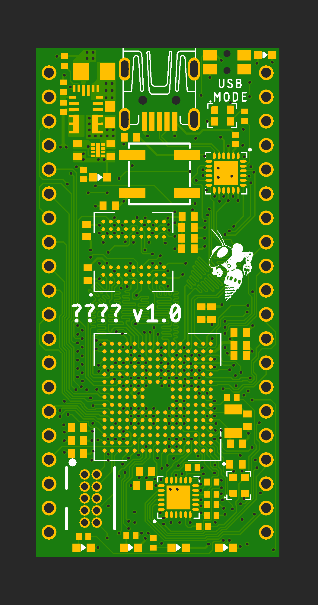

# MCU Board

#### Before modifying ensure layout changes are in compliance with datasheets

PCB for STM32F769NIH6 microcontroller. This board is still very much a work in progress but most of the major components exist and are connected to the MCU. Major components include:
* Microcontroller: STM32F769NIH6
* Flash memory: S25FS256SAGNFI00
* SDRAM: MT48LC16M16A2F4
* USB HS interface: USB3315C
* Ethernet 100/10 interface: LAN8742A

This board is currently only four layers but should be updated to six in a future revision and impedances should be calculated on the traces that matter.

VBAT is currently unused but should be added in to take advantage of the RTC that is on the board.

There is a space for a pull up and pull down resistor on the BOOT pin on the MCU. Only one of these should be populated (by default the pull down should be populated).

OTG functionality is not used with the USB HS interface because that would require a 5V source on the board. A future revision may add this but currently this feature is unneeded.

The four bottom LEDs are connected directly to pins on the MCU but only two of them are connected to PWM pins due to routing constraints. This should be fixed upon moving to 6 layers. The LED next to the button is currently simply used to indicate power, it may be desired to change this in the future to indicate some status of the MCU.

The button labeled USB MODE will be used to toggle the MCU into a state that will show the device as a USB mass storage device, displaying the contents of the flash chip. The LED next to it is used to indicate if it is in this UMS mode.

The power is passed from the USB or the VIN to a buck converter to allow for 4.5V to 24V input with the buck outputing ~3.5V which gets fed into a linear regulator to drop the voltage to 3.3V. The buck is in place for an efficient conversion then the LDO is in place to make sure the power is smoothed out before it is distributed to the sensitive chips.

<!--  -->

